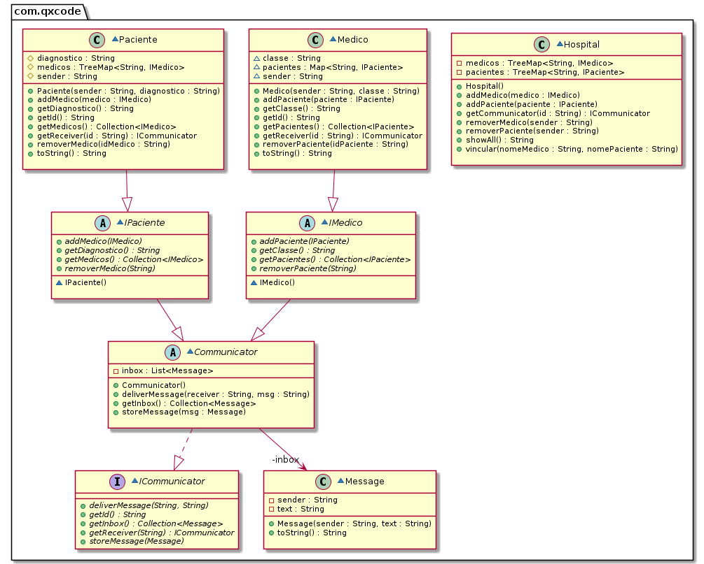

# Hospital II

<!--TOC_BEGIN-->
- [Cadastrar Pacientes, Médicos e Plantões.](#cadastrar-pacientes-médicos-e-plantões)
- [Funcionalidades](#funcionalidades)
- [Interfaces](#interfaces)
- [Diagrama de Classes](#diagrama-de-classes)
<!--TOC_END-->


## Requisitos

Você vai alterar a implementação do Hospital I para habilitar o envio de mensagens entre médicos e pacientes.
- Pacientes só podem enviar mensagens para seus médicos.
- Médicos só podem enviar mensagens para seus pacientes.
- Médicos e pacientes só podem ver suas próprias mensagens.
- As mensagens funcionam no modo de inbox, após lidas, elas "desaparecem".


## Guia
- As classes Paciente e Medico vão ter poucas alterações.
- Precisamos que médicos e pacientes sejam diferentes, mas que ambos se comportem como Comunicadores.
- As antigas interfaces IPaciente e IMedicos vão virar classes abstratas que herdam de Comunicador.
- Em comunicador reside toda a lógica da troca de mensagens. A única peça que falta é que um paciente tem os seus médicos como possíveis destinatários e vice versa.
- Por isso, apenas nas classes Paciente e Médico que é implementado o getReceiver definido na interface ICommunicator.
- Um paciente quando invocado o método getReceiver(id) procura na sua lista de médicos por um médico com esse id e retorna esse objeto médico. Se não encontra, emite uma exception avisando que não possui aquele remetente. O mesmo para o métido.
- A classe Abstrata Communicator implementa o envio de mensagem e o inbox.

***

```sh
#__case inserir
$addPacs fred-fratura alvis-avc goku-hemorragia silva-sinusite
$addMeds bisturi-cirurgia snif-alergologia facada-cirurgia
$show
Pac: alvis:avc        Meds: []
Pac: fred:fratura     Meds: []
Pac: goku:hemorragia  Meds: []
Pac: silva:sinusite   Meds: []
Med: bisturi:cirurgia Pacs: []
Med: facada:cirurgia  Pacs: []
Med: snif:alergologia Pacs: []


#__case vincular
# tie _med _pac _pac ...
$tie bisturi fred alvis goku
$tie snif silva alvis
$tie facada goku
fail: ja existe outro medico da especialidade cirurgia
$show
Pac: alvis:avc        Meds: [bisturi, snif]
Pac: fred:fratura     Meds: [bisturi]
Pac: goku:hemorragia  Meds: [bisturi]
Pac: silva:sinusite   Meds: [snif]
Med: bisturi:cirurgia Pacs: [alvis, fred, goku]
Med: facada:cirurgia  Pacs: []
Med: snif:alergologia Pacs: [alvis, silva]

#__case mensagens
$msg alvis bisturi posso tomar homeprazol?
$msg goku bisturi coceira no reto eh normal?
$inbox bisturi
[alvis:posso tomar homeprazol?]
[goku:coceira no reto eh normal?]
$msg bisturi alvis chupe limao que passa
$msg bisturi goku venha na minha sala pra eu olhar
$inbox goku
[bisturi:venha na minha sala pra eu olhar]
$msg goku facada
fail:goku nao conhece facada
$inbox machado
fail: usuario nao existe
$end
```

***
## Diagrama de Classes


***
## Esqueleto
<!--FILTER Solver.java java-->