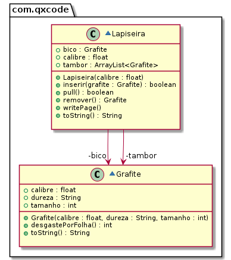

# Lapiseira com vários Grafites


<!--TOC_BEGIN-->
- [Requisitos](#requisitos)
- [Shell](#shell)
- [Diagrama](#diagrama)
- [Esqueleto](#esqueleto)
<!--TOC_END-->

Faça o modelo de uma lapiseira que pode conter vários.

## Requisitos
- Iniciar lapiseira
    - Inicia uma lapiseira de determinado calibre sem grafite.
    - Lapiseiras possuem um bico e um tambor.
    - O bico guarda o grafite que está em uso. 
    - O tambor guarda os grafites reservas.
- Inserir grafite
    - Insere um grafite passando
        - o calibre: float.
        - a dureza: string.
        - o tamanho em mm: int.
    - Não deve aceitar um grafite de calibre não compatível.
    - O grafite é colocado como o ÚLTIMO grafite do tambor.
- Puxar grafite
    - Puxa o grafite do tambor para o bico.
    - Se já tiver um grafite no bico, esse precisa ser removido primeiro.
- Remover grafite
    - Retira o grafite do bico.
- Escrever folha
    - Não é possível escrever se não há grafite no bico.
    - Quanto mais macio o grafite, mais rapidamente ele se acaba. Para simplificar, use a seguinte regra:
        - Grafite HB: 1mm por folha.
        - Grafite 2B: 2mm por folha.
        - Grafite 4B: 4mm por folha.
        - Grafite 6B: 6mm por folha.
        
    - O último centímetro de um grafite não pode ser aproveitado, quando o grafite estiver com 10mm, não é mais possível escrever e o grafite deve ser retirado.
    - Se não houver grafite suficiente para terminar a folha, avise que o texto ficou incompleto.
    - Avise quando o grafite acabar.


## Shell

```bash
#__case inserindo grafites
$init 0.5
$show
calibre: 0.5, bico: [], tambor: {}
$inserir 0.7 2B 50
fail: calibre incompatível
$inserir 0.5 2B 50
$show
calibre: 0.5, bico: [], tambor: {[0.5:2B:50]}
$inserir 0.5 2B 30
$show
calibre: 0.5, bico: [], tambor: {[0.5:2B:50][0.5:2B:30]}
$puxar
$show
calibre: 0.5, bico: [0.5:2B:50], tambor: {[0.5:2B:30]}
$puxar
fail: ja existe grafite no bico
$remover
$show
calibre: 0.5, bico: [], tambor: {[0.5:2B:30]}
$end
```


```bash
#__case escrevendo 1
$init 0.9
$inserir 0.9 4B 14
$inserir 0.9 4B 16
$write
fail: nao existe grafite no bico
$puxar
$show
calibre: 0.9, bico: [0.9:4B:14], tambor: {[0.9:4B:16]}
$write
warning: grafite acabou
$show
calibre: 0.9, bico: [0.9:4B:10], tambor: {[0.9:4B:16]}
$remover
$puxar
$show
calibre: 0.9, bico: [0.9:4B:16], tambor: {}
$write
$show
calibre: 0.9, bico: [0.9:4B:12], tambor: {}
$write
fail: folha incompleta
warning: grafite acabou
$show
calibre: 0.9, bico: [0.9:4B:10], tambor: {}
$end
```


## Diagrama




***
## Esqueleto

<!--FILTER Solver.java java-->
```java
class Grafite {
    public float calibre;
    public String dureza;
    public int tamanho;
    public Grafite(float calibre, String dureza, int tamanho);
    public String toString();
    public int desgastePorFolha();
}
class Lapiseira {
    public float calibre;
    public Grafite bico;
    public ArrayList<Grafite> tambor;
    public Lapiseira(float calibre);
    public String toString();
    public boolean inserir(Grafite grafite);
    public Grafite remover();
    public boolean pull();
    public void writePage();
}
class Solver{
    public static void main(String[] args) {
        Scanner scanner = new Scanner(System.in);
        Lapiseira lapiseira = new Lapiseira(0.5f);
        while(true) {
            String line = scanner.nextLine();
            System.out.println("$" + line);
            String ui[] = line.split(" ");
            if(ui[0].equals("end")) {
                break;
            } else if(ui[0].equals("help")) {
                System.out.println("init _calibre; inserir _calibre _dureza _tamanho; remover; writePage _folhas");
            } else if(ui[0].equals("init")) { //calibre
                lapiseira = new Lapiseira(Float.parseFloat(ui[1]));
            } else if(ui[0].equals("inserir")) {//calibre dureza tamanho
                float calibre = Float.parseFloat(ui[1]);
                String dureza  = ui[2];
                int tamanho = Integer.parseInt(ui[3]);
                lapiseira.inserir(new Grafite(calibre, dureza, tamanho));
            } else if(ui[0].equals("remover")) {
                lapiseira.remover();
            } else if(ui[0].equals("show")) {
                System.out.println(lapiseira);
            } else if (ui[0].equals("write")) {
                lapiseira.writePage();
            } else if (ui[0].equals("puxar")) {
                lapiseira.pull();
            }  else {
                System.out.println("fail: comando invalido");
            }
        }
        scanner.close();
    }
}
```
<!--FILTER_END-->
